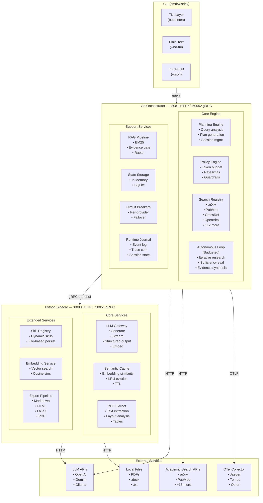
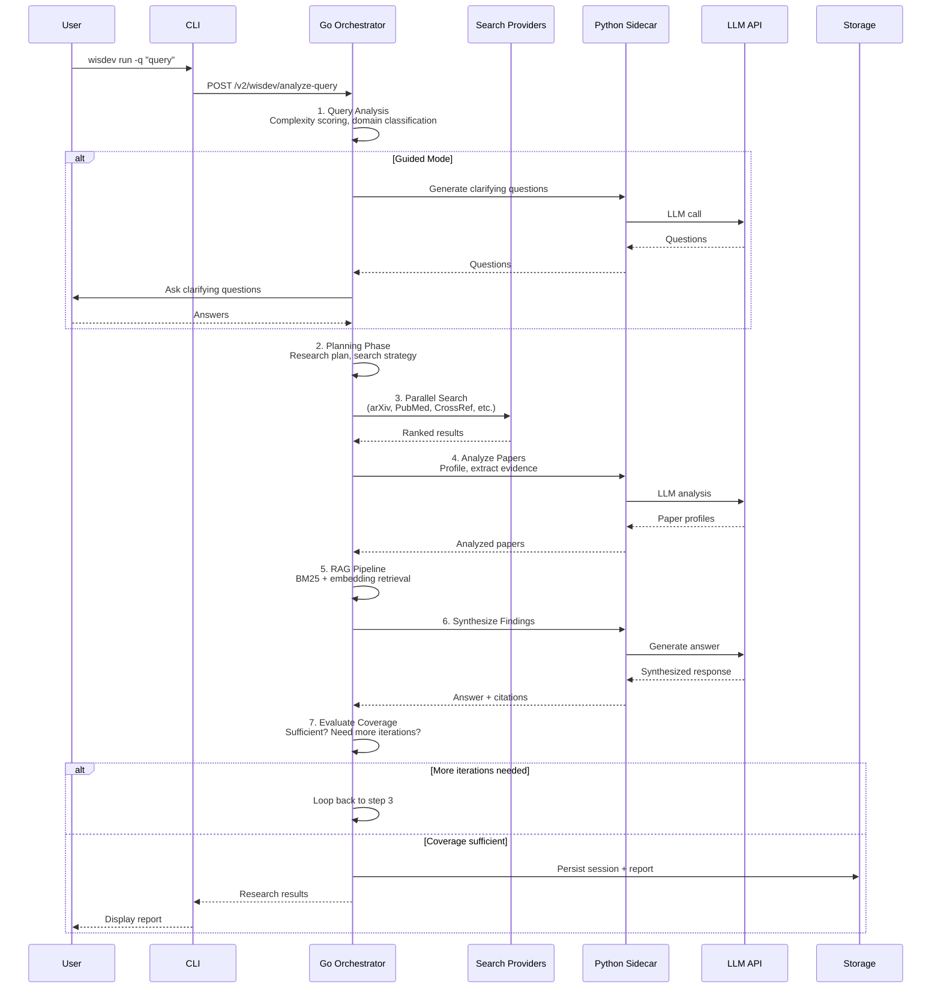
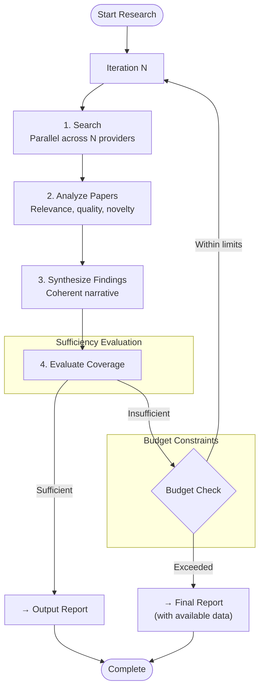
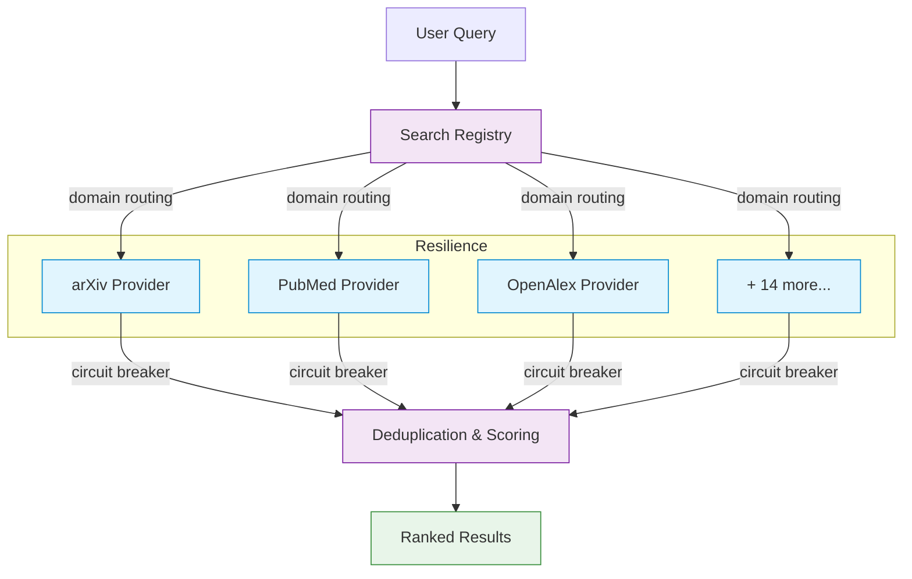
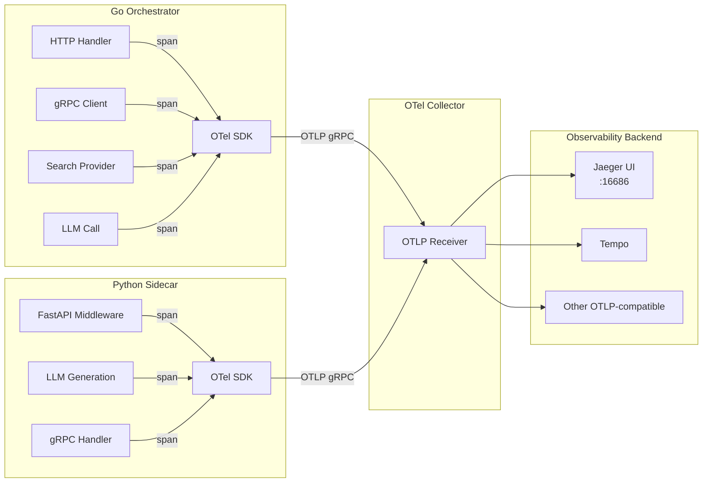
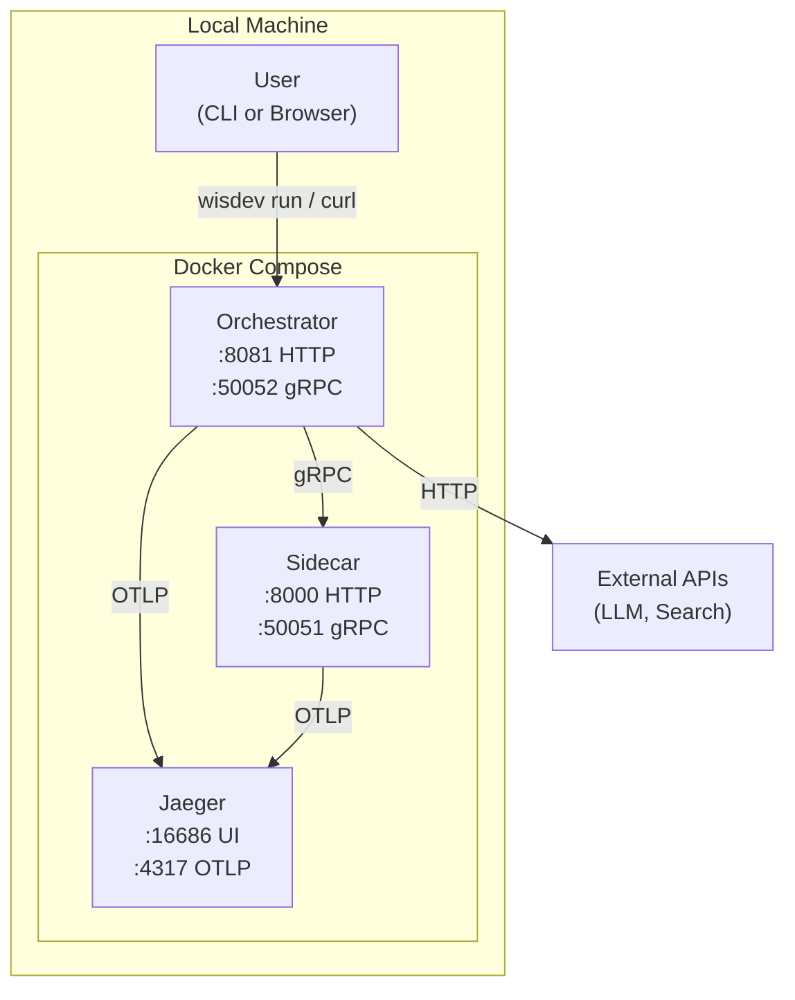
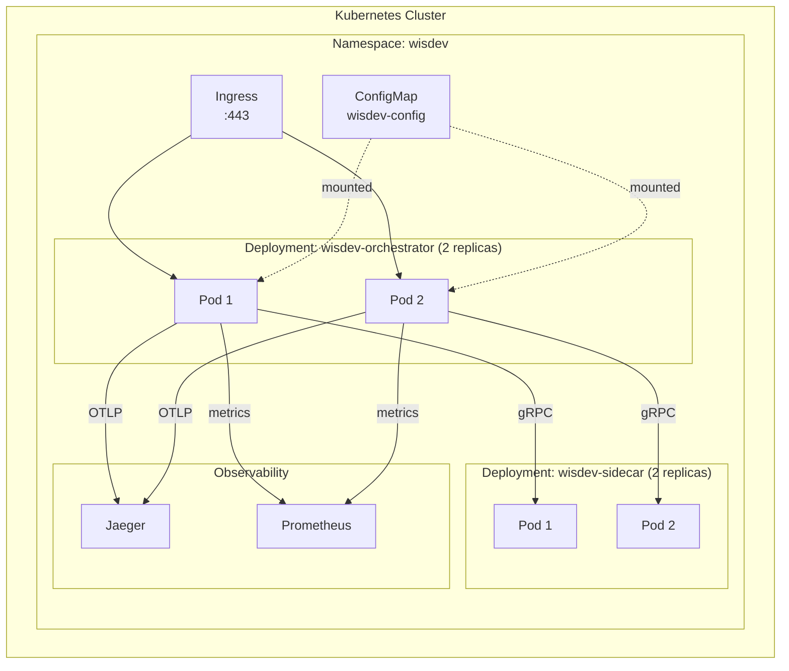

# WisDev Agent (Open Source)

A terminal-first, open-source AI research agent. WisDev plans, executes, and synthesizes deep research tasks across academic sources using a multi-agent architecture.

```
⚡ Query → 📋 Plan → 🔍 Search → 📄 Analyze → 📝 Synthesize → 📊 Report
```

## Table of Contents

- [Architecture](#architecture)
  - [System Overview](#system-overview)
  - [Component Detail](#component-detail)
  - [Data Flow](#data-flow)
  - [Agent Execution Loop](#agent-execution-loop)
- [Quick Start](#quick-start)
- [CLI Reference](#cli-reference)
- [Configuration](#configuration)
- [LLM Providers](#llm-providers)
- [Search Providers](#search-providers)
- [Storage Backends](#storage-backends)
- [API Reference](#api-reference)
- [Observability](#observability)
- [Development](#development)
- [Deployment](#deployment)
- [Troubleshooting](#troubleshooting)
- [Contributing](#contributing)
- [License](#license)

---

## Architecture

### System Overview



### Component Detail

#### Go Orchestrator (`orchestrator/`)

The Go orchestrator is the brain of WisDev. It handles all planning, execution, search, and state management.

| Package | Purpose | Key Files |
|---------|---------|-----------|
| `api/` | HTTP handlers and route registration | `router.go`, `search.go`, `wisdev_v2.go` |
| `internal/wisdev/` | Core agent logic — planning, execution, autonomous loop | `gateway.go`, `autonomous.go`, `session_store.go` |
| `internal/search/` | Academic search across 15+ providers with circuit breakers | `provider.go`, `registry.go`, `circuit.go` |
| `internal/rag/` | RAG pipeline — BM25, evidence gating, Raptor | `engine.go`, `bm25.go`, `evidence_gate.go` |
| `internal/policy/` | Guardrails — token budgets, rate limits, content filters | `policy.go`, `enforcer.go` |
| `internal/llm/` | LLM client abstraction over gRPC sidecar | `client.go` |
| `internal/storage/` | Session storage — in-memory and SQLite backends | `provider.go` |
| `internal/resilience/` | Circuit breakers, degraded mode, secret management | `circuit.go`, `resilience.go`, `secrets.go` |
| `internal/telemetry/` | OpenTelemetry instrumentation with OTLP exporters | `otel.go`, `logger.go`, `metrics.go` |
| `internal/paper/` | Paper profiling, PDF analysis, citation networks | `profiler.go` |

#### Python Sidecar (`sidecar/`)

The Python sidecar handles LLM integrations, prompt engineering, and ML primitives.

| Module | Purpose | Key Files |
|--------|---------|-----------|
| `services/gemini_service.py` | LLM gateway — supports OpenAI-compatible endpoints | `gemini_service.py` |
| `services/semantic_cache.py` | Embedding-based cache with LRU eviction | `semantic_cache.py` |
| `services/dynamic_skill_registry.py` | File-based skill persistence | `dynamic_skill_registry.py` |
| `routers/` | FastAPI route groups for ML, PDF, skills | `ml_router.py`, `pdf_router.py` |
| `models/` | Pydantic request/response schemas | `requests.py`, `responses.py` |
| `prompts/` | AI prompt templates for research tasks | `*.j2` files |
| `storage.py` | Python-side storage provider (mirror of Go) | `storage.py` |
| `telemetry.py` | OTel tracing with structlog correlation | `telemetry.py` |

#### Protobuf (`proto/`)

Shared gRPC definitions for type-safe communication between Go and Python.

| Proto File | Purpose |
|------------|---------|
| `wisdev_v2.proto` | WisDev agent protocol — sessions, plans, execution, observation |
| `llm_v1.proto` | LLM service protocol — generate, stream, embed, structured output |

### Data Flow



### Agent Execution Loop

The autonomous research loop is a budgeted iterative process:



Each iteration:
1. **Searches** across multiple academic providers in parallel
2. **Analyzes** papers for relevance, quality, and novelty
3. **Synthesizes** findings into a coherent narrative
4. **Evaluates** whether the research is sufficient or needs more iterations
5. **Checks** budget constraints (max iterations, token budget, time limit)

---

## Quick Start

### 1. Clone and Configure

```bash
git clone https://github.com/wisdev-agent/wisdev-agent-os.git
cd wisdev-agent-os
cp config/wisdev.example.yaml wisdev.yaml
```

### 2. Configure Your LLM

Edit `wisdev.yaml`:

```yaml
llm:
  provider: openai
  model: gpt-4o
  api_key: ${WISDEV_LLM_API_KEY}
  # For local Ollama:
  # base_url: "http://localhost:11434/v1"
  # model: "llama3.1"
```

### 3. Run with Docker Compose

```bash
docker compose up -d
```

This starts the orchestrator, sidecar, and Jaeger for tracing.

### 4. Run a Research Task

```bash
# Interactive TUI with animated spinner and live progress
wisdev run -q "latest advances in CRISPR gene therapy for sickle cell disease"

# Plain text output (for CI/pipelines)
wisdev run -q "quantum error correction" --no-tui

# Run with a specific mode
wisdev run -q "transformer architecture evolution" --mode guided

# Start the server for HTTP/gRPC access
wisdev server --port 8081

# Manage research sessions
wisdev session list
wisdev session view <session-id>
wisdev session delete <session-id>

# Configuration management
wisdev config init              # Create a new wisdev.yaml
wisdev config show              # Display current config
wisdev config validate          # Validate config and check for issues

# Check version
wisdev version
```

---

## CLI Reference

### Commands

| Command | Description |
|---------|-------------|
| `wisdev run -q "query"` | Execute a research task with TUI |
| `wisdev run -q "query" --no-tui` | Execute without TUI (CI-friendly) |
| `wisdev run -q "query" --json` | Output results as JSON |
| `wisdev run -q "query" --mode guided` | Use guided research mode |
| `wisdev server` | Start the HTTP/gRPC server |
| `wisdev session list` | List all research sessions |
| `wisdev session view <id>` | View session details |
| `wisdev session delete <id>` | Delete a session |
| `wisdev config init` | Generate a new config file |
| `wisdev config validate` | Validate configuration |
| `wisdev version` | Show version information |

### Flags

#### `wisdev run`

| Flag | Default | Description |
|------|---------|-------------|
| `-q` | — | **Required.** Research query |
| `--config` | `wisdev.yaml` | Path to configuration file |
| `--mode` | `autonomous` | Agent mode: `autonomous` or `guided` |
| `--no-tui` | `false` | Disable TUI, use plain text output |
| `--json` | `false` | Output results as JSON |
| `--port` | `8081` | HTTP listen port |
| `--grpc-port` | `50052` | gRPC listen port |

#### `wisdev server`

| Flag | Default | Description |
|------|---------|-------------|
| `--config` | `wisdev.yaml` | Path to configuration file |
| `--port` | `8081` | HTTP listen port |
| `--grpc-port` | `50052` | gRPC listen port |

#### `wisdev session`

| Subcommand | Flags | Description |
|------------|-------|-------------|
| `list` | `--user`, `--config` | List all sessions, optionally filtered by user |
| `view` | `<session-id>`, `--config` | View details of a specific session |
| `delete` | `<session-id>`, `--config` | Delete a session |

#### `wisdev config`

| Subcommand | Flags | Description |
|------------|-------|-------------|
| `init` | `--path`, `--provider`, `--model`, `--storage` | Generate a new config file |
| `show` | `--config` | Display current configuration |
| `validate` | `--config` | Validate configuration and check for issues |

---

## Configuration

### wisdev.yaml

```yaml
agent:
  mode: autonomous          # autonomous or guided
  max_steps: 15             # Maximum execution steps
  token_budget: 100000      # Token budget per session

llm:
  provider: custom           # openai, anthropic, custom
  model: gpt-4o
  api_key: ${WISDEV_LLM_API_KEY}
  base_url: ""               # Set for Ollama: http://localhost:11434/v1

storage:
  type: memory               # memory or sqlite
  dsn: "wisdev_state.db"     # Used when type=sqlite

observability:
  enable_otel: true
  otlp_endpoint: "localhost:4317"

server:
  http_port: 8081
  grpc_port: 50052
  sidecar_host: localhost
  sidecar_port: 8000
```

### Environment Variables

| Variable | Description | Default |
|----------|-------------|---------|
| `WISDEV_LLM_API_KEY` | Your LLM provider API key | — |
| `INTERNAL_SERVICE_KEY` | Service-to-service auth key | — |
| `OTEL_EXPORTER_OTLP_ENDPOINT` | OTLP collector endpoint | `localhost:4317` |
| `LOG_LEVEL` | Log verbosity | `info` |
| `EMBEDDING_API_URL` | External embedding endpoint | — |

### Config Resolution

Configuration is loaded in the following order (later values override earlier):

1. **Defaults** — Built-in defaults for all fields
2. **Config file** — Values from `wisdev.yaml`
3. **Environment variables** — `${VAR_NAME}` syntax in config values
4. **CLI flags** — Command-line arguments override everything

---

## LLM Providers

| Provider | Setup | Notes |
|----------|-------|-------|
| **OpenAI** | Set `api_key` and `model` (e.g., `gpt-4o`) | Default provider |
| **Anthropic** | Set `provider: anthropic` and `api_key` | Claude models |
| **Ollama** | Set `base_url: http://localhost:11434/v1` and `model` | Local inference |
| **Gemini** | Set `api_key` with Google API key | Google's models |
| **Any OpenAI-compatible** | Set `base_url` and `api_key` | vLLM, LM Studio, etc. |

### Local LLM Setup (Ollama)

```bash
# Install Ollama
curl -fsSL https://ollama.com/install.sh | sh

# Pull a model
ollama pull llama3.1

# Configure WisDev
wisdev config init --provider custom --model llama3.1
# Edit wisdev.yaml to set base_url: "http://localhost:11434/v1"
```

---

## Search Providers

The orchestrator includes built-in academic search providers:

| Provider | Domain | Coverage |
|----------|--------|----------|
| arXiv | Preprints | Physics, CS, Math, Biology |
| bioRxiv | Preprints | Biology |
| CrossRef | Metadata | All disciplines |
| CORE | Full-text | All disciplines |
| DBLP | Bibliography | Computer Science |
| DOAJ | Journals | Open access |
| Europe PMC | Biomedical | Life sciences |
| Google Scholar | General | All disciplines |
| IEEE Xplore | Engineering | CS, EE |
| NASA ADS | Astronomy | Astrophysics |
| OpenAlex | Bibliography | All disciplines |
| Papers with Code | ML | Machine Learning |
| PhilPapers | Philosophy | Philosophy |
| PubMed | Biomedical | Medicine |
| RePEc | Economics | Economics |
| Semantic Scholar | General | All disciplines |
| SSRN | Preprints | Social sciences |

### Search Architecture



Each provider has:
- **Circuit breaker** — Automatically disables failing providers
- **Domain routing** — Queries routed to relevant providers
- **Fallback** — Built-in Go search when external providers fail

---

## Storage Backends

### In-Memory (Default)

Fast, ephemeral storage. Ideal for CLI usage and testing.

```yaml
storage:
  type: memory
```

### SQLite

Durable, file-based storage. Ideal for persistent sessions.

```yaml
storage:
  type: sqlite
  dsn: "wisdev_state.db"
```

### Storage Interface

Both backends implement the same interface:

```go
type Provider interface {
    GetSession(ctx context.Context, sessionID string) (*Session, error)
    SaveSession(ctx context.Context, session *Session) error
    DeleteSession(ctx context.Context, sessionID string) error
    ListSessions(ctx context.Context, userID string) ([]*Session, error)
    SaveCheckpoint(ctx context.Context, sessionID string, data []byte) error
    LoadCheckpoint(ctx context.Context, sessionID string) ([]byte, error)
    Close() error
}
```

---

## API Reference

### HTTP Endpoints

#### Health & Readiness

| Endpoint | Method | Description |
|----------|--------|-------------|
| `/healthz` | GET | Liveness probe |
| `/readiness` | GET | Readiness probe |
| `/metrics` | GET | Prometheus metrics |
| `/health` | GET | Legacy health check |

#### Search

| Endpoint | Method | Description |
|----------|--------|-------------|
| `/search` | GET | Legacy search |
| `/v2/search/parallel` | POST | Parallel search across providers |
| `/v2/search/hybrid` | GET/POST | Hybrid search (BM25 + embedding) |
| `/v2/search/batch` | POST | Batch search with multiple queries |
| `/v2/search/tool` | POST | Tool-based search |

#### WisDev Agent

| Endpoint | Method | Description |
|----------|--------|-------------|
| `/v2/wisdev/analyze-query` | POST | Analyze query complexity |
| `/v2/wisdev/programmatic-loop` | POST | Execute programmatic research loop |
| `/v2/wisdev/observe` | POST | Observe agent state |
| `/v2/wisdev/structured-output` | POST | Generate structured output |
| `/v2/wisdev/research/deep` | POST | Deep research with domain filtering |
| `/v2/wisdev/research/autonomous` | POST | Autonomous research execution |

#### RAG

| Endpoint | Method | Description |
|----------|--------|-------------|
| `/v2/rag/answer` | POST | Generate answer from context |
| `/v2/rag/section-context` | POST | Get section context |
| `/v2/rag/raptor/build` | POST | Build RAPTOR index |
| `/v2/rag/raptor/query` | POST | Query RAPTOR index |
| `/v2/rag/bm25/index` | POST | Index documents for BM25 |
| `/v2/rag/bm25/search` | POST | Search BM25 index |
| `/v2/rag/evidence-gate` | POST | Evidence verification gate |

#### Paper

| Endpoint | Method | Description |
|----------|--------|-------------|
| `/v2/paper/profile` | POST | Profile a paper |
| `/v2/paper/extract-pdf` | POST | Extract text from PDF |
| `/v2/export/markdown` | POST | Export to Markdown |
| `/v2/export/html` | POST | Export to HTML |
| `/v2/export/latex` | POST | Export to LaTeX |

### gRPC Endpoints

| Service | Port | Description |
|---------|------|-------------|
| WisDev v2 | `:50052` | Agent protocol (sessions, plans, execution) |
| LLM Service | `:50051` | LLM generation, streaming, embedding |

---

## Observability

Traces are exported via OTLP to any compatible collector. The included `docker-compose.yml` ships with [Jaeger](https://www.jaegertracing.io/):

- **Jaeger UI**: http://localhost:16686
- **OTLP gRPC**: `localhost:4317`
- **OTLP HTTP**: `localhost:4318`

### Tracing Architecture



### Trace Correlation

Every log event includes trace correlation fields:

```json
{
  "level": "info",
  "msg": "research complete",
  "trace_id": "abc123...",
  "span_id": "def456...",
  "session_id": "session-uuid",
  "iterations": 3,
  "papers_found": 15
}
```

### Metrics

| Metric | Type | Description |
|--------|------|-------------|
| `wisdev_search_duration_ms` | Histogram | Search latency per provider |
| `wisdev_llm_tokens` | Counter | Token usage |
| `wisdev_session_count` | Gauge | Active sessions |
| `wisdev_cache_hit_rate` | Gauge | Semantic cache hit rate |

---

## Development

### Prerequisites

| Tool | Version | Purpose |
|------|---------|---------|
| Go | 1.26+ | Orchestrator runtime |
| Python | 3.11+ | Sidecar runtime |
| Docker | 24+ | Containerized deployment |
| buf | 1.28+ | Protobuf code generation |

### Quick Commands

```bash
# Generate protobuf stubs
make proto

# Build binaries
make build

# Run all tests
make test

# Run Go tests with race detector
make test-race

# Run Python tests only
make test-python

# Start full stack locally
docker compose up --build

# Clean generated files
make clean
```

### Project Structure

```
wisdev-agent-os/
├── cmd/wisdev/              # CLI entrypoint (bubbletea TUI)
│   ├── main.go              # TUI model, styles, research loop
│   ├── entrypoint.go        # Command routing
│   ├── cmd_run.go           # Run command handler
│   ├── cmd_server.go        # Server command handler
│   ├── cmd_session.go       # Session management
│   └── cmd_config.go        # Config management
├── orchestrator/            # Go service
│   ├── api/                 # HTTP handlers and routes
│   ├── internal/
│   │   ├── wisdev/          # Core agent logic
│   │   ├── search/          # Academic search providers
│   │   ├── rag/             # RAG pipeline
│   │   ├── policy/          # Guardrails and policy engine
│   │   ├── llm/             # LLM client abstraction
│   │   ├── telemetry/       # OpenTelemetry instrumentation
│   │   ├── storage/         # Session storage (memory/SQLite)
│   │   ├── resilience/      # Circuit breakers, secrets
│   │   └── paper/           # Paper profiling
│   ├── proto/               # Generated Go protobuf stubs
│   └── cmd/
│       ├── server/          # HTTP/gRPC server entrypoint
│       └── wisdev/          # CLI (symlink to root)
├── sidecar/                 # Python service
│   ├── services/            # LLM, cache, skill registry
│   ├── routers/             # FastAPI route groups
│   ├── models/              # Pydantic schemas
│   ├── prompts/             # AI prompt templates
│   └── tests/               # Python tests
├── proto/                   # Protobuf definitions
│   ├── wisdev_v2.proto      # WisDev agent protocol
│   └── llm_v1.proto         # LLM service protocol
├── config/
│   └── wisdev.example.yaml  # Example configuration
├── docker-compose.yml       # Local development stack
├── Makefile                 # Build/test targets
└── README.md                # This file
```

### Adding a New Search Provider

1. Create `internal/search/myprovider.go`:

```go
package search

type MyProvider struct {
    BaseProvider
}

func (p *MyProvider) Name() string { return "myprovider" }
func (p *MyProvider) Domains() []string { return []string{"general"} }
func (p *MyProvider) Search(ctx context.Context, query string, opts SearchOpts) ([]Paper, error) {
    // Implement search logic
    return papers, nil
}
func (p *MyProvider) Healthy() bool { return true }
```

2. Register in `internal/search/registry.go`:

```go
reg.Register(&MyProvider{})
```

### Adding a New Skill

Skills are Python-based and registered via the sidecar:

```python
from services.skill_generation_service import SkillDefinition

skill = SkillDefinition(
    skill_name="my_skill",
    description="Does something useful",
    parameters=[...],
    execution_logic_pseudo="1. Do X\n2. Do Y",
    academic_citation='{"arxiv_id": "..."}',
)
```

---

## Deployment

### Docker Compose (Recommended)



```bash
docker compose up -d
```

Starts orchestrator, sidecar, and Jaeger.

### Kubernetes



```yaml
apiVersion: apps/v1
kind: Deployment
metadata:
  name: wisdev-orchestrator
spec:
  replicas: 2
  selector:
    matchLabels:
      app: wisdev-orchestrator
  template:
    spec:
      containers:
      - name: orchestrator
        image: wisdev-agent-os/orchestrator:latest
        ports:
        - containerPort: 8081
        - containerPort: 50052
        env:
        - name: WISDEV_CONFIG
          value: /app/config/wisdev.yaml
        - name: SIDECAR_HOST
          value: wisdev-sidecar
        - name: SIDECAR_PORT
          value: "8000"
        - name: OTEL_EXPORTER_OTLP_ENDPOINT
          value: jaeger:4317
        volumeMounts:
        - name: config
          mountPath: /app/config
      volumes:
      - name: config
        configMap:
          name: wisdev-config
```

### Bare Metal

```bash
# Build
make build

# Run server
./bin/wisdev-server --config wisdev.yaml

# Run CLI
./bin/wisdev run -q "your query"
```

---

## Troubleshooting

### Common Issues

| Issue | Cause | Solution |
|-------|-------|----------|
| `config error: no such file` | Missing config file | Run `wisdev config init` |
| `LLM API key is not set` | Missing API key | Set `WISDEV_LLM_API_KEY` env var |
| `storage error` | Invalid storage path | Use `type: memory` or valid SQLite path |
| `research failed: context deadline exceeded` | LLM timeout | Increase timeout or check LLM endpoint |
| `search backend unavailable` | All providers failing | Check network, verify provider URLs |

### Debug Mode

```bash
# Enable verbose logging
export LOG_LEVEL=debug

# Run with debug output
wisdev run -q "query" --no-tui
```

### Health Checks

```bash
# Check server health
curl http://localhost:8081/healthz

# Check sidecar health
curl http://localhost:8000/health

# Check Jaeger
curl http://localhost:16686
```

---

## Contributing

See [CONTRIBUTING.md](CONTRIBUTING.md) for detailed contribution guidelines.

### Quick Start for Contributors

```bash
# 1. Fork and clone
git clone https://github.com/YOUR_USERNAME/wisdev-agent-os.git
cd wisdev-agent-os

# 2. Set up development environment
cp config/wisdev.example.yaml wisdev.yaml
make build
make test

# 3. Make your changes
# ... edit code ...

# 4. Run tests
make test-race

# 5. Commit and push
git add .
git commit -m "feat: add new search provider"
git push origin main
```

### Code Style

#### Go
- Follow `gofmt` formatting
- Use `go vet` before committing
- Table-driven tests with descriptive subtest names
- Document all exported functions, types, and constants

#### Python
- Follow PEP 8
- Run `ruff check .` before committing
- Type hints on all function signatures
- Docstrings for public functions and classes

### Commit Messages

Use conventional commit format:

```
feat: add SQLite storage provider
fix: handle empty query in semantic cache
docs: update README with Ollama setup
test: add policy engine edge cases
```

---

## License

This project is licensed under the [Apache License 2.0](LICENSE).
