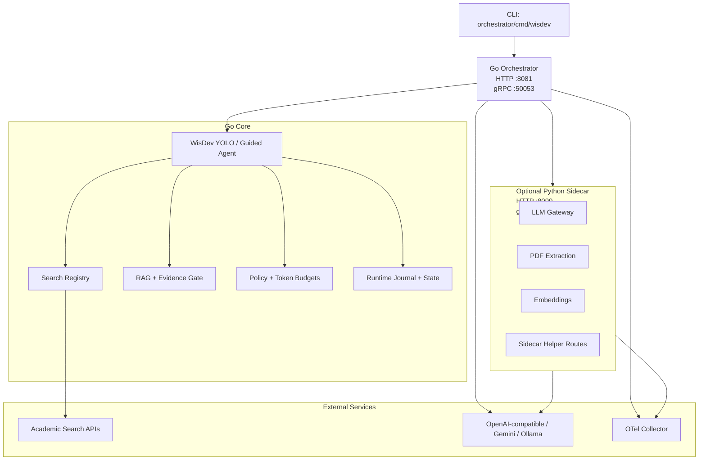

# WisDev Agent OS

WisDev Agent OS is the open-source WisDev YOLO research agent runtime. It is a terminal-first agent stack for planning, executing, and synthesizing evidence-grounded research tasks across academic sources.

```text
Query -> Plan -> Search -> Analyze -> Synthesize -> Report
```

This repository is seeded from the current WisDev runtime rather than the old archived app. The goal is to preserve current YOLO behavior first, then keep private parent-app integrations behind clean adapter boundaries.

The runtime target is Go plus optional Python only:

- Go owns the agent, API, CLI, orchestration, search, RAG, evidence, policy, persistence, telemetry, and local validation paths.
- Python is optional and limited to ML, LLM, embedding, PDF, and document-processing primitives.
- Rust is intentionally excluded from this open-source project.

## Contents

- [Architecture](#architecture)
- [Repository Layout](#repository-layout)
- [Quick Start](#quick-start)
- [CLI Reference](#cli-reference)
- [Configuration](#configuration)
- [Search Providers](#search-providers)
- [Embedding API](#embedding-api)
- [API Surface](#api-surface)
- [Observability](#observability)
- [Development](#development)
- [Docker](#docker)
- [Release Readiness](#release-readiness)
- [Compatibility](#compatibility)
- [License](#license)

## Architecture



### Execution Loop

WisDev YOLO runs a bounded research loop:

1. Normalize the task and infer research intent.
2. Plan search terms and evidence targets.
3. Retrieve papers through selected providers.
4. Analyze and rank evidence.
5. Synthesize a provisional answer.
6. Evaluate coverage gaps and contradictions.
7. Iterate until the budget is exhausted or enough evidence is available.
8. Emit a final report, trace events, and optional persisted state.

`--offline` keeps the loop local and avoids external search providers, which is useful for smoke tests and CI.

## Repository Layout

```text
orchestrator/                     Go-owned runtime and API
orchestrator/cmd/wisdev/          CLI entrypoint
orchestrator/cmd/server/          HTTP/gRPC server entrypoint
orchestrator/pkg/wisdev/          Public Go embedding API
orchestrator/internal/wisdev/     YOLO, guided planning, execution, memory
orchestrator/internal/search/     Academic providers, routing, fan-out
orchestrator/internal/rag/        Retrieval, BM25, RAPTOR, evidence helpers
orchestrator/internal/evidence/   Citation and evidence utilities
orchestrator/internal/policy/     Go-local policy and validation
orchestrator/proto/               Go protobuf contracts
sidecar/                          Optional Python ML/LLM worker
config/                           Open-source config templates
adapters/scholarlm/               Private parent-app adapter notes only
docs/                             Migration status and release checklist
scripts/                          Local verification helpers
```

## Quick Start

### Windows / PowerShell

```powershell
cd wisdev-agent-os
copy .env.example .env
.\scripts\verify.ps1 -StaticRelease
.\scripts\verify.ps1 -Go -PythonContract

cd orchestrator
go run ./cmd/wisdev --help
```

### Unix-like Shell

```bash
cd wisdev-agent-os
cp .env.example .env
make test-all
make cli-help
```

### Run a Local Offline YOLO Smoke

```powershell
cd wisdev-agent-os
.\scripts\verify.ps1 -SmokeLocal
```

Equivalent direct command:

```powershell
cd wisdev-agent-os\orchestrator
go run ./cmd/wisdev yolo --local --offline --max-iterations 1 "map retrieval augmented research agent evidence"
```

### Run the Go Server

```powershell
cd wisdev-agent-os\orchestrator
go run ./cmd/server
```

### Call an Already-running Orchestrator

```powershell
cd wisdev-agent-os\orchestrator
go run ./cmd/wisdev yolo "map the evidence for retrieval augmented research agents"
```

### Run Local Mode With Selected Providers

```powershell
cd wisdev-agent-os\orchestrator
go run ./cmd/wisdev yolo --local --provider openalex,arxiv "map retrieval augmented research agent evidence"
```

## CLI Reference

Current extracted CLI:

```text
wisdev yolo [--url http://127.0.0.1:8081] [--json] "task"
wisdev yolo --local [--offline] [--provider openalex,arxiv] [--json] "task"
wisdev serve
```

Environment:

| Variable | Description | Default |
| --- | --- | --- |
| `WISDEV_ORCHESTRATOR_URL` | HTTP base URL used by non-local CLI mode | `http://127.0.0.1:8081` |
| `WISDEV_CONFIG` | Agent config path | `config/wisdev.example.yaml` |
| `WISDEV_MODEL_CONFIG` | Model-tier JSON config path | `config/wisdev_models.example.json` |
| `WISDEV_STATE_DIR` | Local state directory | `.wisdev/state` |
| `WISDEV_JOURNAL_PATH` | Local runtime journal path | `.wisdev/wisdev_journal.jsonl` |
| `WISDEV_LLM_BASE_URL` | OpenAI-compatible model endpoint | `http://127.0.0.1:11434/v1` |
| `WISDEV_LLM_MODEL` | Default model ID for local compatible endpoints | `llama3.1` |
| `WISDEV_LLM_API_KEY` | Optional model API key | empty |
| `PYTHON_SIDECAR_HTTP_URL` | Optional sidecar HTTP URL | `http://127.0.0.1:8090` |
| `PYTHON_SIDECAR_GRPC_ADDR` | Optional sidecar gRPC address | `127.0.0.1:50052` |
| `TEMPORAL_ENABLED` | Optional durable execution backend toggle | `false` |

## Configuration

Main config template:

```yaml
agent:
  mode: yolo
  max_steps: 25
  require_approval: false
  workspace: "."

llm:
  provider: openai-compatible
  model_tier: standard
  model: "${WISDEV_LLM_MODEL}"
  api_key_env: WISDEV_LLM_API_KEY
  base_url: "${WISDEV_LLM_BASE_URL}"

storage:
  type: local
  state_dir: "${WISDEV_STATE_DIR}"
  journal_path: "${WISDEV_JOURNAL_PATH}"

execution:
  backend: local-journal
  temporal_enabled: false

sidecar:
  enabled: true
  http_url: "${PYTHON_SIDECAR_HTTP_URL}"
  grpc_addr: "${PYTHON_SIDECAR_GRPC_ADDR}"

observability:
  structured_logs: true
  otel_enabled: false
  redact_prompts: true
```

Model tier defaults live in `config/wisdev_models.example.json`:

```json
{
  "light": "gemini-2.5-flash-lite",
  "standard": "gemini-2.5-flash",
  "heavy": "gemini-2.5-pro"
}
```

Override with `WISDEV_MODEL_CONFIG` or copy the example to a local `wisdev_models.json`.

## Search Providers

The Go orchestrator includes academic search provider implementations and domain routing. Common providers include:

| Provider | Domain Fit |
| --- | --- |
| `semantic_scholar` | General academic search |
| `openalex` | Broad metadata and citation graph |
| `arxiv` | CS, math, physics, ML preprints |
| `pubmed` | Biomedical literature |
| `europe_pmc` | Life sciences and biomedical full text metadata |
| `crossref` | DOI and publisher metadata |
| `core` | Open access full text metadata |
| `doaj` | Open access journals |
| `dblp` | Computer science bibliography |
| `biorxiv`, `medrxiv` | Biology and medical preprints |
| `ssrn`, `repec` | Social science and economics |
| `philpapers` | Philosophy |
| `nasa_ads` | Astronomy and astrophysics |
| `papers_with_code` | Machine learning papers and code links |

Local CLI provider selection:

```powershell
go run ./cmd/wisdev yolo --local --provider openalex,arxiv "query"
```

For no-provider smoke tests:

```powershell
go run ./cmd/wisdev yolo --local --offline "query"
```

## Embedding API

The public Go facade lets downstream applications embed WisDev without importing internal packages:

```go
package main

import (
    "context"
    "fmt"

    "github.com/wisdev/wisdev-agent-os/orchestrator/pkg/wisdev"
)

func main() {
    agent := wisdev.NewAgent(wisdev.WithNoSearchProviders())
    result, err := agent.RunYOLO(context.Background(), wisdev.YOLORequest{
        Task: "map open source research agent evidence",
    })
    if err != nil {
        panic(err)
    }
    fmt.Println(result.Summary)
}
```

Custom search providers can be injected through `wisdev.WithSearchProviders(myProvider)`.

## API Surface

The Go server exposes unversioned route families:

| Route Family | Purpose |
| --- | --- |
| `/health`, `/healthz`, `/readiness`, `/metrics` | Health, readiness, Prometheus metrics |
| `/search/*` | Parallel, hybrid, batch, query expansion, and tool search |
| `/wisdev/*` | Planning, sessions, guided/yolo execution, research, policy, traces |
| `/agent/yolo/*` | YOLO execute/status/stream/cancel compatibility surface |
| `/rag/*` | RAG answer, section context, BM25, RAPTOR, hybrid retrieval |
| `/paper/*`, `/papers/*` | PDF extraction, paper profile, count, related, network |
| `/export/*` | Markdown, HTML, LaTeX export helpers |
| `/full-paper/*`, `/drafting/*`, `/manuscript/*`, `/reviewer/*` | Long-form writing and review helpers |
| `/vector/*`, `/query/*`, `/summarization/*`, `/source/*`, `/topic-tree/*` | Utility primitives |
| `/internal/*` | Service-to-service operational hooks |

Sidecar route families include:

| Route Family | Purpose |
| --- | --- |
| `/ml/pdf` | PDF text extraction |
| `/ml/embed` | Embedding generation |
| `/ml/bm25/*` | Local BM25 helper surface |
| `/llm/generate`, `/llm/generate/stream` | LLM generation |
| `/llm/structured-output` | Schema-backed generation |
| `/llm/embed`, `/llm/embed/batch` | Remote embedding helpers |
| `/wisdev/deep-agents/*` | Internal sidecar helpers retained for Go-owned orchestration |
| `gRPC :50052` | LLM service for local/container overlays |

## Observability

WisDev emits structured logs and supports OpenTelemetry exporters. Useful trace fields include:

- `service`
- `runtime`
- `component`
- `operation`
- `stage`
- `trace_id`
- `request_id`
- `session_id`
- `provider`
- `latency_ms`
- `result`
- `error_code`

The default local config keeps OTel disabled. Enable it with config/env once you have a collector available.

## Development

Prerequisites:

| Tool | Purpose |
| --- | --- |
| Go 1.25+ | Orchestrator, CLI, tests |
| Python 3.11+ | Optional sidecar and Python tests |
| Docker | Optional container validation |

Common commands:

```powershell
.\scripts\verify.ps1 -StaticRelease
.\scripts\verify.ps1 -Go
.\scripts\verify.ps1 -PythonContract
.\scripts\verify.ps1 -SmokeLocal
```

Unix-like equivalents:

```bash
make test-go
make test-python-contract
make smoke-local
```

Python sidecar setup:

```powershell
cd sidecar
python -m venv .venv
.\.venv\Scripts\python -m pip install -r requirements.txt
python -m pytest -q tests/unit/test_stack_contract.py
```

`langextract` is optional. PDF metadata extraction falls back to regex-only behavior when it is absent.

## Docker

Start both services:

```bash
docker compose up --build
```

Services:

| Service | Ports | Notes |
| --- | --- | --- |
| `orchestrator` | `8081`, `50053` | Go API and internal gRPC |
| `sidecar` | `8090`, `50052` | Optional Python HTTP/gRPC worker |

Docker contexts have `.dockerignore` files to avoid copying `.env`, journals, caches, credentials, and local build artifacts into images.

## Release Readiness

Before publishing, run:

```powershell
.\scripts\verify.ps1 -StaticRelease
.\scripts\verify.ps1 -Go
.\scripts\verify.ps1 -PythonContract
.\scripts\verify.ps1 -SmokeLocal
```

Then follow `docs/RELEASE_CHECKLIST.md`.

Known local-machine limitation in this checkout: Docker validation cannot run unless Docker is installed.

## Compatibility

- `adapters/scholarlm/` is documentation-only for the private parent app boundary.
- `scholarlmSearchPapers` remains a search-tool compatibility alias while callers migrate to `wisdevSearchPapers`.
- Migration provenance is tracked in `docs/MIGRATION_STATUS.md`.
- Private app integrations, frontend auth assumptions, commerce routes, document-app routes, and Rust gateway code are not part of this open-source runtime.

## License

Apache-2.0. See `LICENSE` and `NOTICE`.
