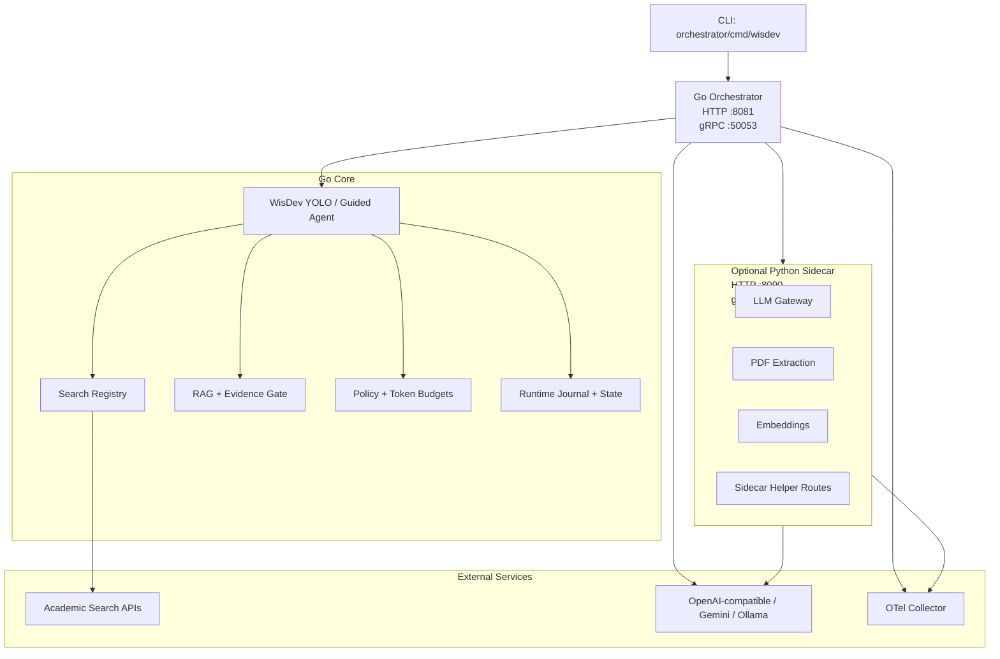

<p align="center">
  
</p>

# WisDev ARC — Agent Research Core

[](https://cloud.google.com/vertex-ai)
[](https://google.github.io/adk-docs/)
[](https://modelcontextprotocol.io/)

**Open-source autonomous research agent** — Google ADK + MCP + Gemini on GCP.  
Live product: [ScholarLM](https://scholarlm-vbc.web.app)

WisDev ARC (Agent Research Core) is the open-source WisDev YOLO research agent runtime and public project identity. It is a high-performance, terminal-first agent stack for planning, executing, and synthesizing evidence-grounded research tasks across academic sources.

### Quickstart (60 seconds)

```bash
git clone https://github.com/bharathvbcr/WisDev.git
cd wisdev-arc
make check
wisdev "What evidence supports RAG for scientific literature?"
```

Documentation: [`docs/ARCHITECTURE.md`](docs/ARCHITECTURE.md) · [`docs/CLI.md`](docs/CLI.md) · [`docs/MCP_CLIENTS.md`](docs/MCP_CLIENTS.md) · [`docs/COMMANDS.md`](docs/COMMANDS.md)

```text
Query -> Plan -> Search -> Analyze -> Synthesize -> Report -> DocGen (optional)
```

WisDev ARC is a modular Go + ADK + MCP runtime for autonomous, evidence-grounded research. It evolves alongside ScholarLM with private parent-app integrations kept behind clean adapter boundaries.

The runtime architecture uses Go and optional Python worker services:

- **Go** owns the core agent runtime, API, CLI, orchestration, search registry, RAG pipelines, evidence scoring, policy execution, persistence, telemetry, and local validation.
- **Python** is optional and handles ML primitives, LLM gateways, embeddings, PDF parsing, and document-processing workers.

## Contents

- [Architecture](#architecture)
- [Repository Layout](#repository-layout)
- [Install](#install)
- [Quick Start](#quick-start)
- [CLI Reference](#cli-reference)
- [DocGen (ScholarDoc)](#docgen-scholardoc)
- [Configuration](#configuration)
- [Search Providers](#search-providers)
- [Embedding API](#embedding-api)
- [API Surface](#api-surface)
- [Observability](#observability)
- [Development](#development)
- [GitNexus Index](#gitnexus-index)
- [Docker](#docker)
- [Release Readiness](#release-readiness)
- [Compatibility](#compatibility)
- [License](#license)

## Architecture


```mermaid
graph TB
    CLI["CLI: orchestrator/cmd/wisdev"] --> Go["Go Orchestrator<br/>HTTP :8081<br/>gRPC :50053"]

    subgraph GoCore["Go Core"]
        Agent["WisDev YOLO / Guided Agent"]
        Search["Search Registry"]
        RAG["RAG + Evidence Gate"]
        Policy["Policy + Token Budgets"]
        Journal["Runtime Journal + State"]
    end

    subgraph Py["Optional Python Sidecar<br/>HTTP :8090<br/>gRPC :50052"]
        LLM["LLM Gateway"]
        PDF["PDF Extraction"]
        Embed["Embeddings"]
        Skills["Sidecar Helper Routes"]
    end

    subgraph External["External Services"]
        Academic["Academic Search APIs"]
        Models["OpenAI-compatible / Gemini / Ollama"]
        OTel["OTel Collector"]
    end

    Go --> Agent
    Agent --> Search
    Agent --> RAG
    Agent --> Policy
    Agent --> Journal
    Search --> Academic
    Go --> Py
    Py --> Models
    Go --> Models
    Go --> OTel
    Py --> OTel
```

### Execution Loop

WisDev YOLO runs a bounded research loop:

1. Normalize the task and infer research intent.
2. Plan search terms and evidence targets.
3. Retrieve papers through selected search providers.
4. Analyze and rank evidence based on relevance and quality.
5. Synthesize a provisional answer with inline citations.
6. Evaluate coverage gaps and contradictions.
7. Iterate until target budget is reached or evidence converges.
8. Emit a final structured report, trace events, and optional persisted state.

`--offline` keeps execution strictly local with synthetic mock providers, ideal for offline tests and CI.

## Repository Layout

```text
orchestrator/                     Go-owned runtime, API, and CLI
orchestrator/cmd/wisdev/          CLI entrypoint
orchestrator/cmd/server/          HTTP/gRPC server entrypoint
orchestrator/pkg/wisdev/          Public Go embedding API
orchestrator/internal/wisdev/     YOLO agent, guided planning, execution, memory
orchestrator/internal/search/     Academic provider registry, domain routing, fan-out
orchestrator/internal/rag/        Retrieval, BM25, RAPTOR, evidence synthesis
orchestrator/internal/evidence/   Citation scoring and bibliography formatters
orchestrator/internal/docgen/     ScholarDoc document generator (report, litreview, fullpaper)
orchestrator/internal/policy/     Go-local policy gates and budget enforcement
orchestrator/proto/               Protobuf contracts
sidecar/                          Optional Python ML/LLM worker
config/                           Open-source configuration templates
adapters/scholarlm/               Private parent-app adapter notes
docs/                             Architecture guides, CLI reference, and migration status
scripts/                          Build and local verification scripts
```

## Install

One-line installation (downloads the latest release binary or builds from source with Go 1.25+):

```bash
curl -fsSL https://raw.githubusercontent.com/bharathvbcr/WisDev/main/scripts/install.sh | bash
```

```powershell
irm https://raw.githubusercontent.com/bharathvbcr/WisDev/main/scripts/install.ps1 | iex
```

From a checkout, `make install-cli` builds and installs the `wisdev` binary to `$GOPATH/bin`.

Then verify and run:

```bash
wisdev check
wisdev "What evidence supports RAG for scientific literature?"
```

### Use from Claude Code / Cursor (MCP)

```bash
claude mcp add wisdev -- wisdev mcp
```

Exposes search tools (`wisdevSearchPapers`, `wisdevPaperLookup`, `wisdevEvidenceSearch`, `wisdevAuthorSearch`) plus **DocGen** (`wisdevGenerateManuscript` — headless ScholarDoc document generation). See [`docs/MCP_CLIENTS.md`](docs/MCP_CLIENTS.md) for Cursor and Claude Desktop configuration details.

## Quick Start

### Unix-like Shell

```bash
cd wisdev-arc
cp .env.example .env
make test-all
make cli-help
```

### Windows / PowerShell

```powershell
cd wisdev-arc
copy .env.example .env
.\scripts\verify.ps1 -StaticRelease
.\scripts\verify.ps1 -Go -PythonContract

.\wisdev.cmd --help
make install-cli
```

### Run an Offline Local YOLO Smoke

```bash
wisdev search --offline --max-iterations 1 "map retrieval augmented research agent evidence"
```

### Run the Orchestrator Server

```bash
cd orchestrator
go run ./cmd/server
```

## CLI Reference

```text
wisdev "question"
wisdev max "question"
wisdev docgen [--intent report|litreview|fullpaper] [--citation-style apa|mla|…] [--format md|latex|html|docx|json] "topic"
wisdev yolo --docgen [--doc-intent …] [--doc-citation-style …] [--doc-format …] "question"
wisdev check
wisdev tui
wisdev mcp
wisdev setup --write .cursor/mcp.json
wisdev serve
wisdev update [--check]
wisdev guide
```

Full CLI reference: [`docs/CLI.md`](docs/CLI.md) and [`docs/COMMANDS.md`](docs/COMMANDS.md).

## DocGen (ScholarDoc)

WisDev ARC generates ScholarDoc documents **fully headless** (Go + optional Python sidecar). Three document **intents** share one canonical pipeline (`internal/docgen`):

| Intent | Flag | What it produces |
| --- | --- | --- |
| `fullpaper` (default) | `--intent fullpaper` | Grounded manuscript: plan → draft → review → fact-check → references |
| `report` | `--intent report` | Quick Report — fast thematic synthesis from retrieved papers |
| `litreview` | `--intent litreview` | Thematic literature review with grounded citations |

**Citation styles:** `apa` (default), `mla`, `chicago`, `vancouver`, `ieee`, `harvard`, `nature`.

**Export formats:** `markdown` (default), `latex`, `html`, `json`, `docx` (CLI only; requires `pandoc` on PATH).

```powershell
# Quick report, offline scaffold
wisdev docgen --offline --intent report --citation-style ieee "clinical RAG"

# Literature review as HTML
wisdev docgen --intent litreview --format html --offline "graph neural networks"

# Full manuscript with citation floor and custom sections
wisdev docgen --intent fullpaper --min-citations 10 --flow introduction,methods,results,discussion "battery anodes"

# Research + document in one run
wisdev yolo --docgen --doc-intent fullpaper --doc-citation-style apa "topic"
```

## Configuration

Main config template (`config/wisdev.example.yaml`):

```yaml
agent:
  mode: yolo
  max_steps: 25
  require_approval: false
  workspace: "."

llm:
  provider: openai-compatible
  model_tier: standard
  model: "${WISDEV_LLM_MODEL}"
  api_key_env: WISDEV_LLM_API_KEY
  base_url: "${WISDEV_LLM_BASE_URL}"

storage:
  type: local
  state_dir: "${WISDEV_STATE_DIR}"
  journal_path: "${WISDEV_JOURNAL_PATH}"

execution:
  backend: local-journal
  temporal_enabled: false

sidecar:
  enabled: true
  http_url: "${PYTHON_SIDECAR_HTTP_URL}"
  grpc_addr: "${PYTHON_SIDECAR_GRPC_ADDR}"

observability:
  structured_logs: true
  otel_enabled: false
  redact_prompts: true
```

Environment Variables:

| Variable | Description | Default |
| --- | --- | --- |
| `WISDEV_ORCHESTRATOR_URL` | HTTP base URL used by non-local CLI mode | `http://127.0.0.1:8081` |
| `WISDEV_CONFIG` | Agent config path | `config/wisdev.example.yaml` |
| `WISDEV_STATE_DIR` | Local state directory | `.wisdev/state` |
| `WISDEV_JOURNAL_PATH` | Local runtime journal path | `.wisdev/wisdev_journal.jsonl` |
| `WISDEV_LLM_BASE_URL` | OpenAI-compatible model endpoint | `http://127.0.0.1:11434/v1` |
| `WISDEV_LLM_MODEL` | Default model ID for local compatible endpoints | `llama3.1` |
| `WISDEV_LLM_API_KEY` | Optional model API key | empty |
| `PYTHON_SIDECAR_HTTP_URL` | Optional sidecar HTTP URL | `http://127.0.0.1:8090` |
| `PYTHON_SIDECAR_GRPC_ADDR` | Optional sidecar gRPC address | `127.0.0.1:50052` |

## Search Providers

The Go orchestrator includes academic search provider implementations and domain routing:

| Provider | Domain Fit |
| --- | --- |
| `semantic_scholar` | General academic search |
| `openalex` | Broad metadata and citation graph |
| `arxiv` | CS, math, physics, ML preprints |
| `pubmed` | Biomedical literature |
| `europe_pmc` | Life sciences and biomedical full text metadata |
| `crossref` | DOI and publisher metadata |
| `core` | Open access full text metadata |
| `doaj` | Open access journals |
| `dblp` | Computer science bibliography |
| `biorxiv`, `medrxiv` | Biology and medical preprints |
| `ssrn`, `repec` | Social science and economics |
| `philpapers` | Philosophy |
| `nasa_ads` | Astronomy and astrophysics |
| `papers_with_code` | Machine learning papers and code links |

Select providers via CLI:

```powershell
wisdev search --provider openalex,arxiv "query"
```

## Embedding API

The public Go facade (`pkg/wisdev`) allows embedding WisDev into Go applications:

```go
package main

import (
    "context"
    "fmt"

    "github.com/bharathvbcr/wisdev-arc/orchestrator/pkg/wisdev"
)

func main() {
    agent := wisdev.NewAgent(wisdev.WithNoSearchProviders())
    result, err := agent.RunYOLO(context.Background(), wisdev.YOLORequest{
        Task: "map open source research agent evidence",
    })
    if err != nil {
        panic(err)
    }
    fmt.Println(result.Summary)
}
```

## API Surface

The Go server exposes unversioned HTTP/gRPC route families:

| Route Family | Purpose |
| --- | --- |
| `/health`, `/healthz`, `/readiness`, `/metrics` | Health, readiness, Prometheus metrics |
| `/search/*` | Parallel, hybrid, batch, and query expansion search |
| `/wisdev/*` | Planning, sessions, guided/yolo execution, policy, traces |
| `/rag/*` | RAG answer, section context, BM25, RAPTOR, hybrid retrieval |
| `/paper/*`, `/papers/*` | PDF extraction, paper profile, network mapping |
| `/export/*` | Markdown, HTML, LaTeX, and DOCX export helpers |
| `/full-paper/*`, `/drafting/*` | Long-form manuscript writing and review synthesis |

Sidecar HTTP/gRPC routes:

| Route Family | Purpose |
| --- | --- |
| `/ml/pdf` | PDF text extraction |
| `/ml/embed` | Embedding generation |
| `/llm/generate`, `/llm/generate/stream` | LLM generation |
| `/llm/structured-output` | Schema-backed JSON output |

## Observability

WisDev emits structured `slog` logs and supports OpenTelemetry trace propagation. Standard log context fields:

`service`, `runtime`, `component`, `operation`, `stage`, `trace_id`, `request_id`, `session_id`, `provider`, `latency_ms`, `result`, `error_code`.

## Development

Prerequisites: Go 1.25+, Python 3.11+ (optional sidecar).

```bash
make test-go
make test-python-contract
make smoke-local
```

PowerShell verification script:

```powershell
.\scripts\verify.ps1 -StaticRelease
.\scripts\verify.ps1 -Go
.\scripts\verify.ps1 -PythonContract
```

## GitNexus Index

Initialize or refresh the local GitNexus code index:

```bash
make gitnexus-index
make gitnexus-status
```

## Docker

Run orchestrator and sidecar via Docker Compose:

```bash
docker compose up --build
```

## Release Readiness

Before tagging or releasing:

```bash
make test-all
make smoke-local
```

Refer to [`docs/RELEASE_CHECKLIST.md`](docs/RELEASE_CHECKLIST.md) for full release procedures.

## Compatibility

- `adapters/scholarlm/` documents private parent-app adapter boundaries.
- `wisdevSearchPapers` is the canonical MCP tool name; legacy aliases are supported for backwards compatibility.
- Provenance details are documented in [`docs/MIGRATION_STATUS.md`](docs/MIGRATION_STATUS.md).

## License

Apache-2.0. See [`LICENSE`](LICENSE) and [`NOTICE`](NOTICE).
