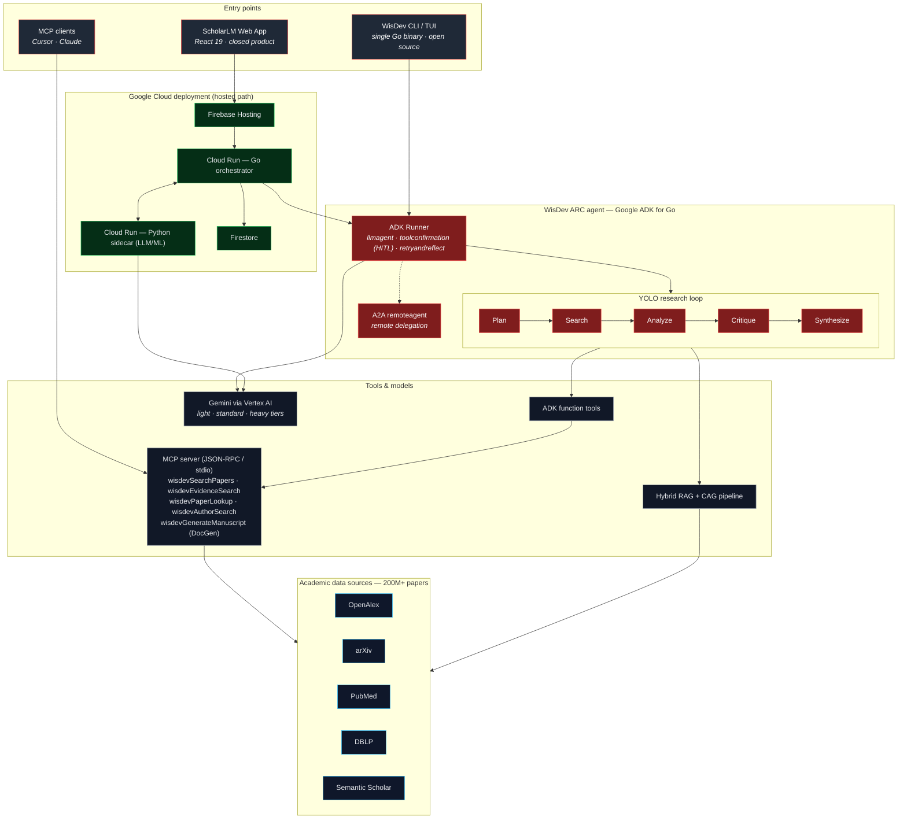

# WisDev ARC — Architecture

ScholarLM is a closed prototype product. **WisDev ARC** is the open-source
autonomous research agent that powers it (Apache-2.0). The same agent runs
hosted (Cloud Run) and locally (single binary / TUI / MCP server).

> **Boundary with SaaS ScholarLM:** Parent-app SaaS ownership (billing, secrets,
> session authority, manuscript verify/rescore, CRS) lives in
> `backend/go_orchestrator`. ARC DocGen / CLI / MCP are the OSS twin — do not
> treat ARC as the owner of SaaS routes or citation-authority brokering (Rust-first
> in the parent app). Parent architecture map:
> [`../../docs/dev/architecture/ARCHITECTURE.md`](../../docs/dev/architecture/ARCHITECTURE.md).



## Reading the diagram

- **Three ways in, one agent.** The hosted web app, the local CLI/TUI, and
  any MCP client all drive the *same* WisDev ARC runtime.
- **ADK is the spine.** The ADK `Runner` orchestrates the autonomous YOLO loop
  (Plan → Search → Analyze → Critique → Synthesize) with human-in-the-loop tool
  confirmation, retry/reflect self-correction, and A2A remote delegation.
- **MCP is the tool & distribution layer.** Academic-search tools and headless
  ScholarDoc document generation (`wisdevGenerateManuscript`) are exposed over MCP,
  so the agent works in Cursor/Claude/CI, not just our UI.
- **Gemini via Vertex AI** does planning, critique, and long-form synthesis
  across light/standard/heavy tiers.
- **Hosted vs. local.** The cloud path adds a Go orchestrator + Python sidecar on
  Cloud Run, Firebase Hosting, and Firestore; the local path is a single Go binary
  with no login required.

## Headless document generation & evidence synthesis (ScholarDoc & Dossier)

ScholarDoc documents and Evidence Dossiers are generated through a shared Go layer:

```text
CLI / TUI / MCP / pkg/wisdev.GenerateDocument
        │
        ▼
internal/evidence & internal/docgen.Generate(intent, options)
        │
        ├── Evidence Dossier → Verified findings, tentative insights, contradictions, gaps
        │
        ├── report     → Quick Report synthesis (ScholarDoc)
        ├── litreview  → Literature-review synthesis + grounded citations (ScholarDoc)
        └── fullpaper  → ManuscriptPipeline: plan → draft → review → fact-check (ScholarDoc)
        │
        ▼
internal/docgen.Render(format, citationStyle)
        │
        ▼
internal/citations (APA, MLA, Chicago, Vancouver, IEEE, Harvard, Nature)
```

**Evidence Dossier** collects and structures paper evidence (verified findings, tentative insights, contradictions, gaps, and paper source packages).

**ScholarDoc** generates structured research documents across three **intents** (`report`, `litreview`, `fullpaper`) sharing one canonical `ScholarDoc` envelope. Seven **citation styles** format bibliographies consistently across markdown, LaTeX, HTML, JSON, and DOCX (CLI) export. The Python sidecar enriches `fullpaper` section prose when reachable; all intents degrade to grounded scaffolds offline.
