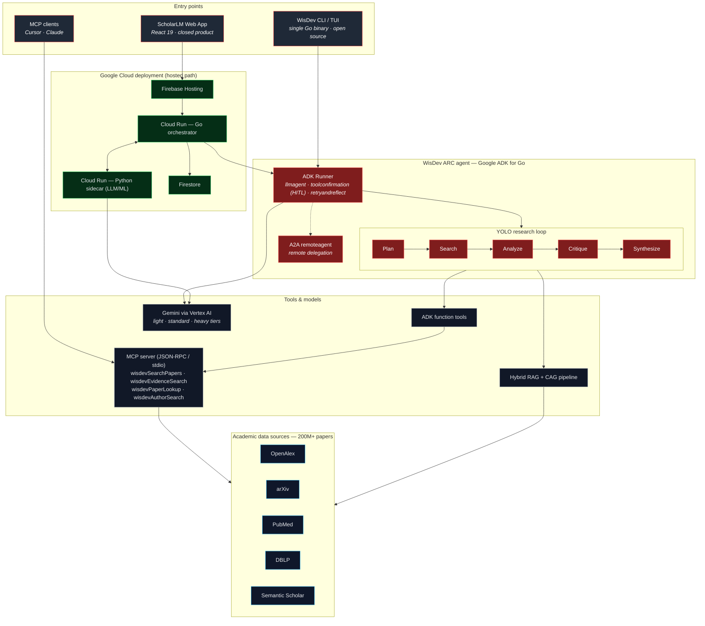

# WisDev ARC — Architecture & Project Overview

**ScholarLM** is a closed prototype research platform. **WisDev ARC** is the
open-source autonomous research agent that powers it (Apache-2.0). The *same*
agent runs hosted on Google Cloud and locally as a single binary / TUI / MCP server.

- **Live product:** https://scholarlm-vbcr.web.app
- **Open-source agent:** https://github.com/bharathvbcr/WisDev
- **Install in one line:** `curl -fsSL https://raw.githubusercontent.com/bharathvbcr/WisDev/main/scripts/install.sh | bash`

---

## Architecture

**Three ways in, one agent.** The hosted web app, the local CLI/TUI, and any MCP
client all drive the same WisDev ARC runtime. ADK orchestrates the autonomous
YOLO loop (Plan → Search → Analyze → Critique → Synthesize) with human-in-the-loop
tool confirmation, retry/reflect self-correction, and A2A remote delegation.
Gemini via Vertex AI handles planning, critique, and long-form synthesis.

---

## Problem to solve
Researchers waste hours on academic search: broad keyword queries return mostly
irrelevant results, evidence is scattered across siloed databases (PubMed, arXiv,
OpenAlex, DBLP), and synthesizing a defensible, citation-grounded answer is manual
and slow. Existing AI tools hallucinate citations and act as a black box — you
can't see *why* a claim is supported, or run the agent on your own terms.

## Our solution
Given a question, WisDev runs a fully autonomous loop: **plan → parallel
multi-source search → rank by evidence → critique (gap & contradiction analysis)
→ synthesize a traceable, cited answer.** It searches 200M+ papers across
domain-specific APIs, verifies evidence before asserting it, and produces
publication-ready output with real citations. ScholarLM (hosted) is the polished
front end; WisDev ARC (the agent) is open source so anyone can run it, inspect it,
wire it into their own stack via MCP, and improve it.

## Technologies used
- **Google ADK for Go** — `llmagent`, `runner`, `functiontool`, `toolconfirmation`
  (HITL), `retryandreflect`, `remoteagent` (A2A)
- **Gemini** (light/standard/heavy) via **Vertex AI**
- **Model Context Protocol (MCP)** — JSON-RPC server over stdio, 4 academic-search tools
- **Google Cloud Run** (Go orchestrator + Python sidecar), **Firebase Hosting**, **Firestore**
- Hybrid **RAG + CAG** retrieval; Go 1.25; React 19 + Vite 6 (thin display layer)

## Data sources
OpenAlex, arXiv, PubMed, DBLP, Semantic Scholar (200M+ works, domain-routed).
MCP tools: `wisdevSearchPapers`, `wisdevEvidenceSearch`, `wisdevPaperLookup`,
`wisdevAuthorSearch`. All public/openly-licensed academic APIs.

## Findings and learnings
- ADK for Go is young but production-capable — a multi-step autonomous loop with
  HITL confirmation and retry/reflect compiles to a fast, dependency-free single binary.
- MCP is the unlock for distribution: the same tools that power the product run in
  Cursor/Claude/CI, not just our UI.
- Bridging MCP tools into ADK function tools by hand was the biggest friction point.
- Critique-before-synthesis materially improves trust — an explicit
  gap/contradiction pass catches unsupported claims a single-shot RAG answer asserts.
- Provider-agnostic paid off: the same loop runs on Gemini/Vertex in the cloud and
  on a local model offline for CI smoke tests.

## Third-party integrations
OpenAlex, arXiv, PubMed, DBLP, Semantic Scholar — public, openly-licensed APIs used
within their terms. No proprietary SDKs, datasets, or restricted content. Agent
runtime is Apache-2.0.

## Testing access
- **Live demo:** https://scholarlm-vbcr.web.app — anonymous guest login works, no credentials needed.
- **Run the agent locally:** `curl -fsSL https://raw.githubusercontent.com/bharathvbcr/WisDev/main/scripts/install.sh | bash` (Windows: `irm https://raw.githubusercontent.com/bharathvbcr/WisDev/main/scripts/install.ps1 | iex`), then `wisdev "your research question"`.
