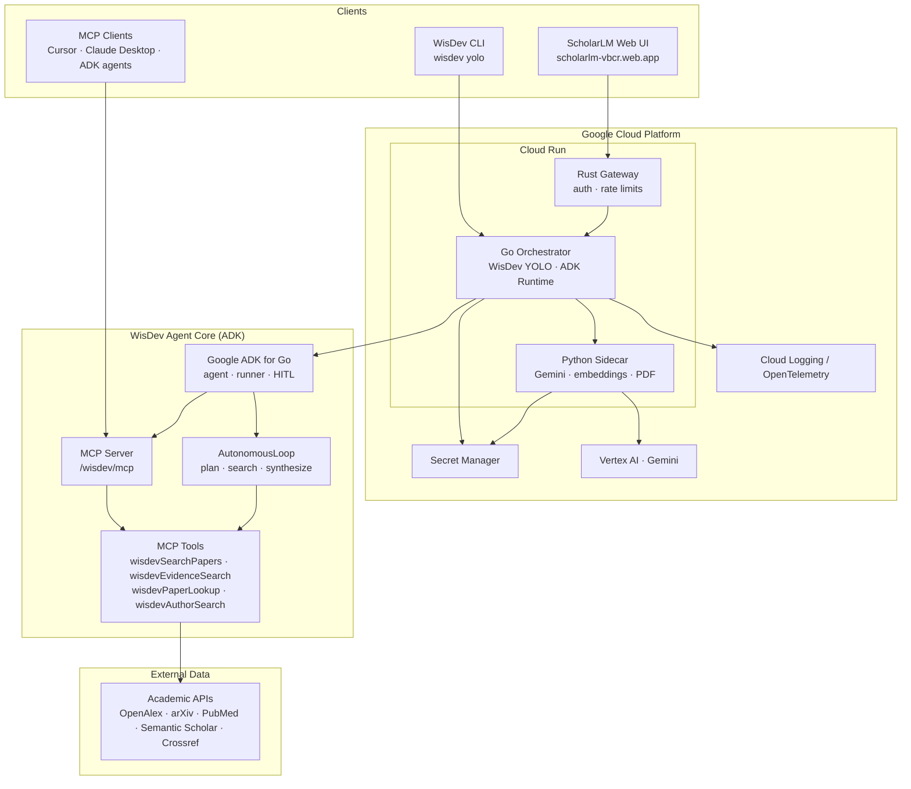
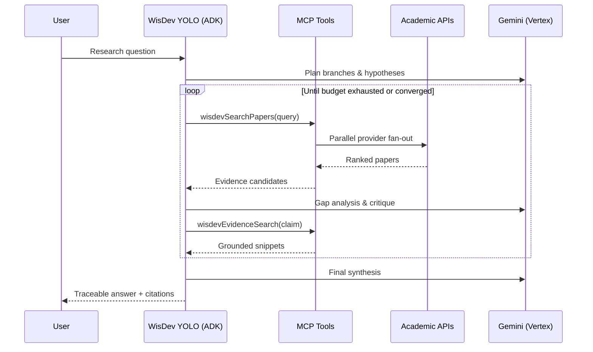

# WisDev — Submission Architecture Diagram

Export this diagram for Devpost (screenshot or [mermaid.live](https://mermaid.live) → PNG/SVG).

---

## System overview



---

## Autonomous YOLO execution flow



---

## Technology map (challenge requirements)

| Requirement | Implementation |
|---|---|
| Gemini | Vertex AI via Python sidecar + ADK Gemini model |
| ADK | `google.golang.org/adk` — agent, runner, function tools, HITL |
| MCP | JSON-RPC 2.0 server at `/wisdev/mcp` + ADK bridge |
| GCP hosted | Cloud Run stack + Firebase Hosting |
| Acts autonomously | WisDev YOLO mode — no intake Q&A required |

---

## Repo layout (open source)

```text
WisDev/
├── orchestrator/          Go agent runtime (ADK, MCP, YOLO loop)
│   ├── cmd/wisdev/        CLI
│   ├── cmd/server/        HTTP API
│   ├── internal/wisdev/   AutonomousLoop, ADKRuntime, MCPServer
│   └── pkg/wisdev/        Public RunYOLO() embedding API
├── sidecar/               Python Gemini / ML primitives
├── config/                wisdev-adk.yaml, wisdev.example.yaml
└── docs/hackathon/        This submission package
```
